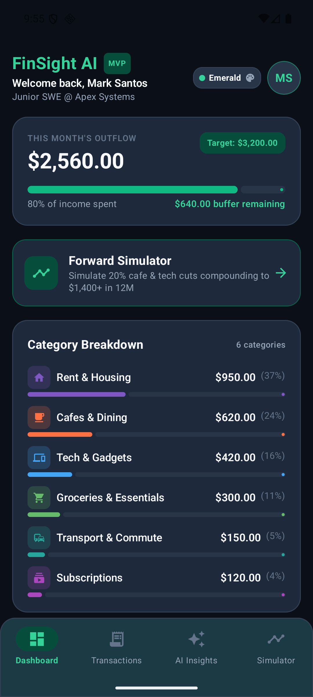
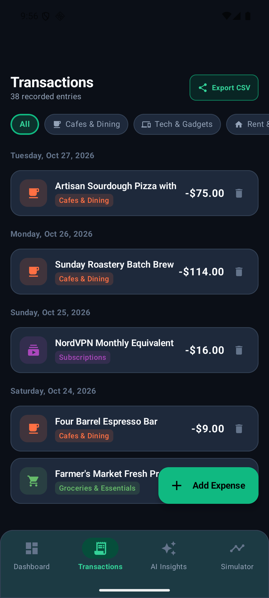
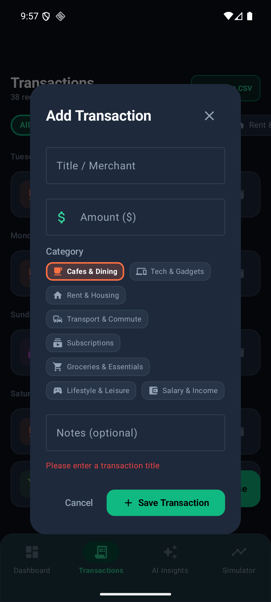
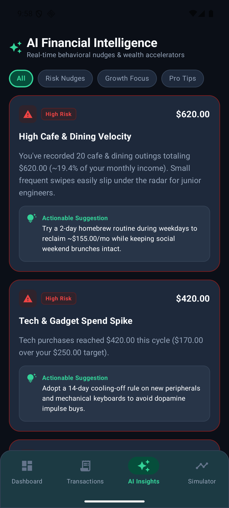
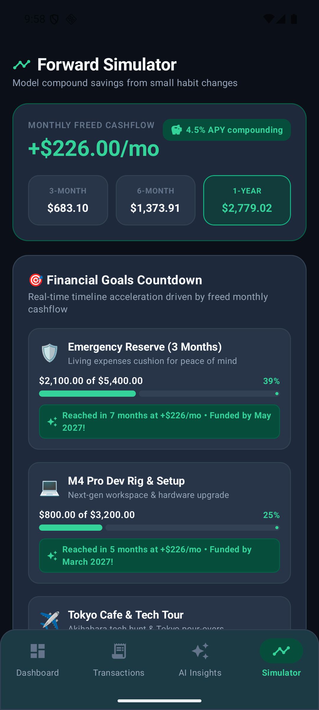
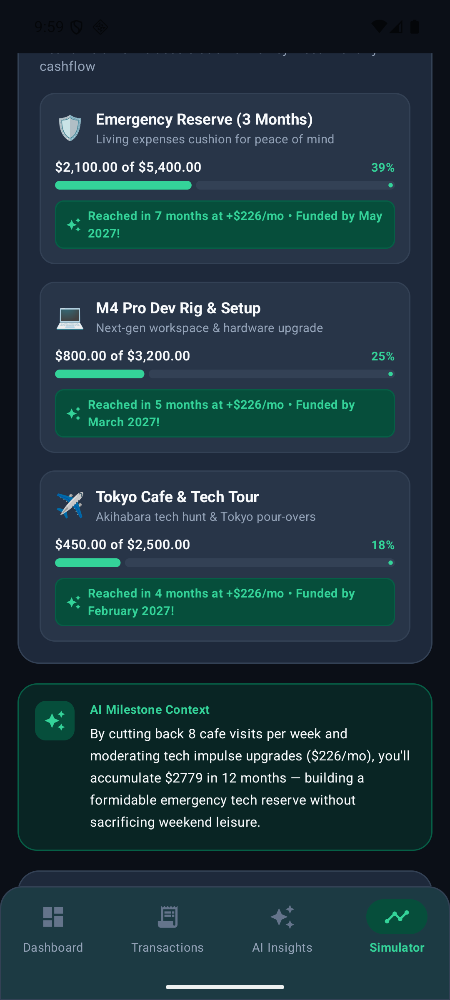

# FinSight AI 📱💡
> **Intelligent financial decision-making for early-career earners.**

<div align="center">

### ⚡ [📲 CLICK HERE TO DIRECTLY DOWNLOAD APK (`finsight-ai.apk`)](https://github.com/itsonlyfranz/finsight-android/releases/latest/download/finsight-ai.apk) ⚡
*(Automatic 1-click download • 19.5 MB • Ready to install on Android)*

[-10B981?style=for-the-badge&logo=android&logoColor=white)](https://github.com/itsonlyfranz/finsight-android/releases/latest/download/finsight-ai.apk)
[](https://github.com/itsonlyfranz/finsight-android/raw/main/finsight-ai.apk)

</div>

FinSight AI is a native Android application built with **Jetpack Compose**, **Material 3**, **SQLite on-device persistence**, and an on-device **AI Behavioral Insights & Forward Simulation Engine**. It bridges the gap between passive expense logging and active financial planning for young professionals facing early-career lifestyle inflation.

---

## 🎯 Target Audience & Persona
- **Primary Persona**: **Mark Santos**, 24 years old, single. Junior Software Engineer at Apex Systems ($3,200/mo net income).
- **Core Challenge**: Struggles to maintain consistent savings due to lifestyle inflation, frequent cafe visits, and tech gadget impulse buys.
- **POV**: *"Young professionals need actionable financial interpretation because raw transaction numbers fail to motivate lasting behavioral change."*

---

## 📸 Live Application Screenshots (Android Device / Emulator)

| **1. The Expense Dashboard** | **2. Transaction Log & CSV Export** |
|:---:|:---:|
|  |  |
| *Monthly outflow totals, budget gauge ($2,560/$3,200), visual category allocation, and theme switcher.* | *Grouped chronological history, category filters, CSV Export button, and "+ Add Expense" FAB.* |

| **3. Add Transaction Dialog** | **4. AI Financial Intelligence** |
|:---:|:---:|
|  |  |
| *Fast on-device CRUD with category tags, amount validation, and optional notes.* | *Behavioral Risk Nudges (Cafe velocity, Tech spend spikes) with actionable recommendations.* |

| **5. Forward Simulator & Goals Countdown** | **6. AI Milestone Context & Goals** |
|:---:|:---:|
|  |  |
| *Monthly freed cashflow (+$226/mo), 3M/6M/12M compound growth (4.5% APY), and goal countdowns.* | *Dynamic progress bars and real-time funding milestone calculations (Emergency Reserve, M4 Pro Dev Rig, Tokyo Tour).* |

---

## 🏗️ Architecture & Features

### 1. On-Device SQLite Persistence
- Powered by `FinSightDatabaseHelper` managing `transactions`, `budgets`, and `settings` tables.
- All changes persist permanently on device across app restarts.
- Auto-seeds with the Mark Santos dataset on first launch.

### 2. CSV Data Export & Sharing (From Impact-Effort Matrix)
- Export transactions into RFC 4180-compliant CSV format with a single tap.
- Uses Android `FileProvider` and native system Sharesheet (`Intent.ACTION_SEND`).

### 3. AI Behavioral Insights Engine
- `AiInsightsEngine` evaluates spending velocity, cafe hopping frequency (>8 visits/mo), and tech discretionary spikes.
- Emits **Risk Nudges** (spending warnings), **Growth Focus** (positive reinforcement), and **Career Pro Tips** (401k match, WFH stipends).

### 4. Goal-Oriented Forward Simulator
- Interactive cutback sliders (Dining, Tech, Subscriptions).
- Computes deterministic compound projections for 3, 6, and 12-month horizons.
- **Financial Goals Countdown**: Dynamic countdowns for Emergency Reserve (3 months buffer), Dev Rig Setup, and Travel.
- **AI Milestone Context**: Natural-language encouragement contextualizing saved dollars into tangible life wins.

### 5. Multi-Theme Customizer
- **Deck Emerald** (Default sleek slate & emerald green)
- **Cyber Slate** (High-contrast tech violet)
- **Midnight Blue** (Deep ocean navy & cyan)

---

## 🧪 Testing & Verification
All unit tests run via Gradle test runner:
```bash
./gradlew testDebugUnitTest
```
- **32 unit tests passing** (0 failures, 0 errors):
  - `AiInsightsEngineTest`: 6 tests
  - `ForwardSimulatorEngineTest`: 7 tests
  - `FinSightRepositoryTest`: 9 tests
  - `FinSightViewModelTest`: 6 tests
  - `CsvExporterTest`: 2 tests
  - `MainScreenViewModelTest`: 2 tests

---

## 🚀 Building & Running

### Build Debug APK
```bash
./gradlew assembleDebug
```
Output APK: `app/build/outputs/apk/debug/app-debug.apk`

### Install on Device / Emulator
```bash
adb install -r app/build/outputs/apk/debug/app-debug.apk
adb shell am start -n com.finsight.ai/com.example.finsightai.MainActivity
```

---

## 📄 License
MIT License. Created based on the FinSight AI ideation by Señor Roberto Francisco M. Pablo.
