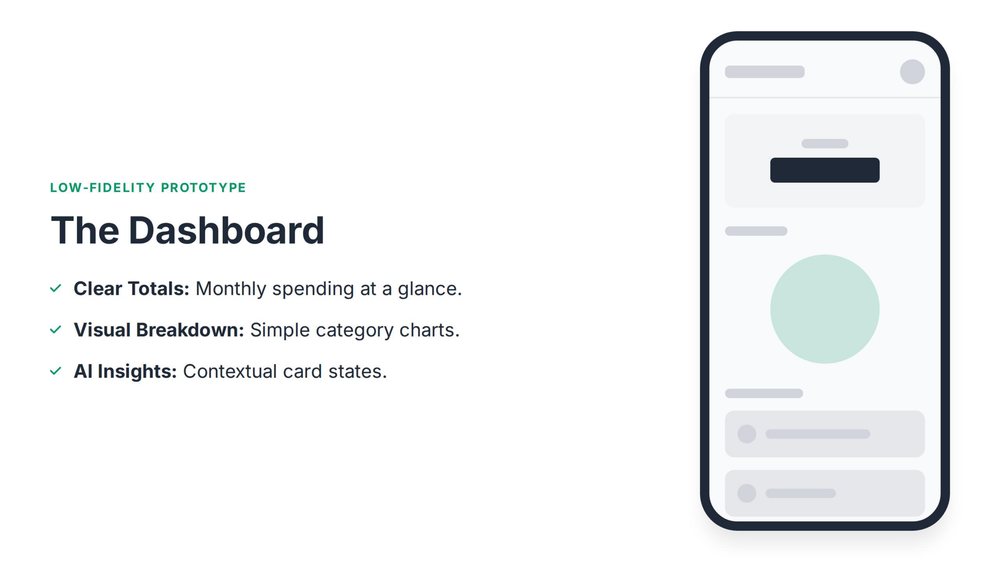
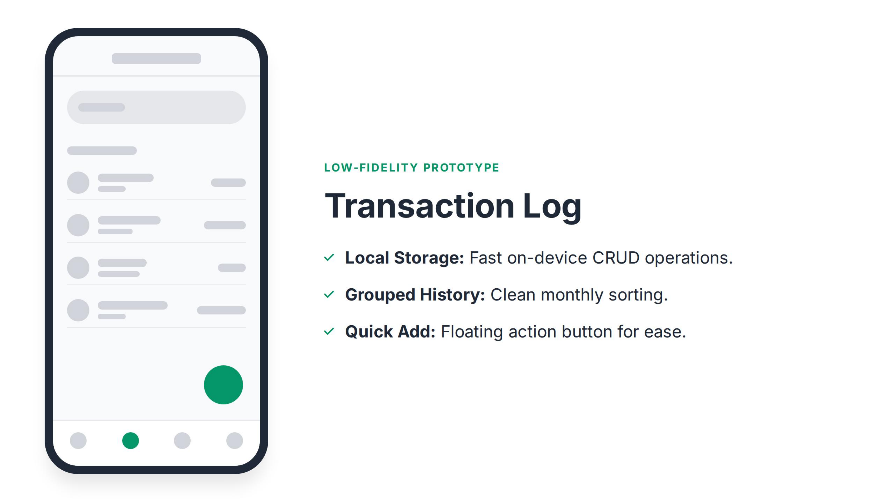
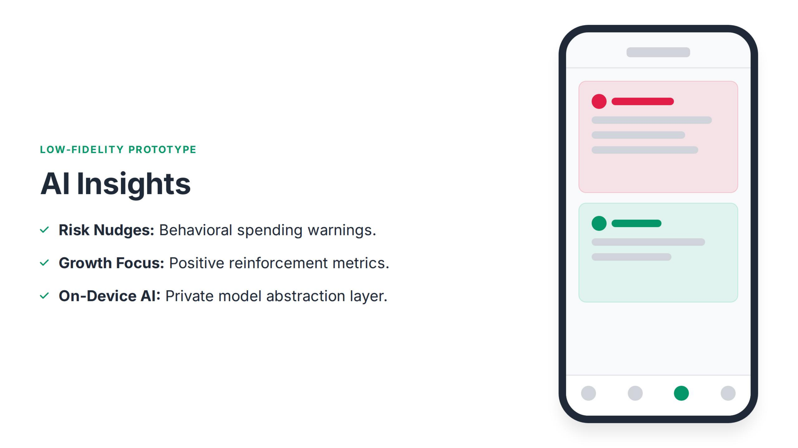
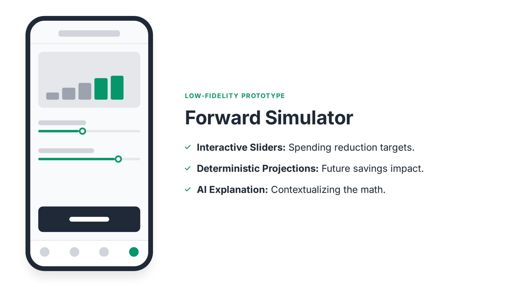

# FinSight AI 📱💡
> **Intelligent financial decision-making for early-career earners.**

FinSight AI is a native Android mobile application built with **Jetpack Compose**, **Material 3**, and an on-device **AI Behavioral Insights & Forward Simulation Engine**. It bridges the gap between passive expense logging and active financial planning for young professionals experiencing early career lifestyle inflation.

---

## 🎯 Target Audience & Persona
- **Primary Persona**: **Mark Santos**, 24 years old, single. Junior Software Engineer at Apex Systems ($3,200/mo net income).
- **Core Challenge**: Struggles to maintain consistent savings due to lifestyle inflation, frequent cafe visits, and tech gadget purchases.
- **POV**: *"Young professionals need actionable financial interpretation because raw transaction numbers fail to motivate lasting behavioral change."*

---

## 📸 Screenshots & Low-Fidelity Prototypes

### 1. The Expense Dashboard
Monthly spending totals at a glance, visual category breakdown progress, and top active AI insight cards.



---

### 2. Transaction Log
Fast local on-device CRUD, grouped monthly and date sorting, category filter chips, and a Quick Add Floating Action Button (FAB).



---

### 3. AI Insights Engine
Behavioral **Risk Nudges** (lifestyle warnings, cafe hopping frequency alerts), **Growth Focus** (positive reinforcement, emergency fund runway), and early-career pro-tips.



---

### 4. Forward Simulator
Interactive cutback sliders for discretionary categories with deterministic compound projections for 3, 6, and 12-month savings milestones and contextual AI explanations.



---

## 🏗️ Architecture & Tech Stack

- **Platform**: Android Native (minSdk 24, compileSdk 36, targetSdk 36)
- **UI Framework**: Modern **Jetpack Compose** + **Material 3**
- **Theme**: Dark Slate (`#0B0F17` / `#1E293B`) with Emerald Green (`#10B981`) and Coral Red (`#EF4444`) accents
- **Architecture**: MVVM + Clean Architecture with Kotlin Coroutines and `StateFlow`
- **AI Engine**:
  - `AiInsightsEngine`: Pattern-matching heuristic engine for spending velocity, discretionary creep, and financial resilience.
  - `ForwardSimulatorEngine`: Deterministic compound calculations (4.5% annual yield) translating raw math into practical life milestones.
- **Persistence**: `FinSightRepository` with pre-seeded Mark Santos data and real-time CRUD operations.

---

## 🚀 Building & Running

### Prerequisites
- JDK 17 or JDK 21 (e.g. from Android Studio)
- Android SDK 36 (Android 16 preview / Android 15 platform)

### Build Debug APK
```bash
./gradlew assembleDebug
```
The resulting APK will be located at:
`app/build/outputs/apk/debug/app-debug.apk`

### Run Unit Tests
```bash
./gradlew testDebugUnitTest
```
All 24 unit tests covering models, AI rules, compound projection math, and ViewModel state transitions will run.

---

## 📄 License
MIT License. Created based on the FinSight AI ideation by Señor Roberto Francisco M. Pablo.
